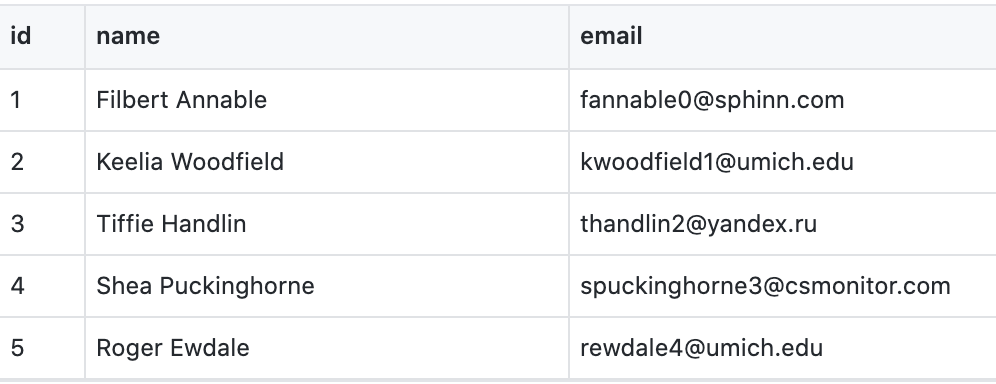
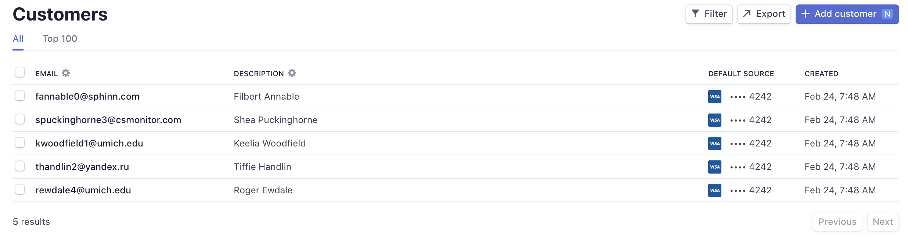
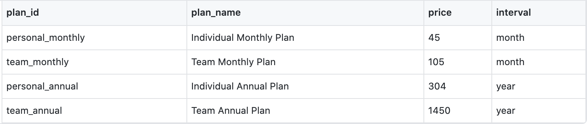
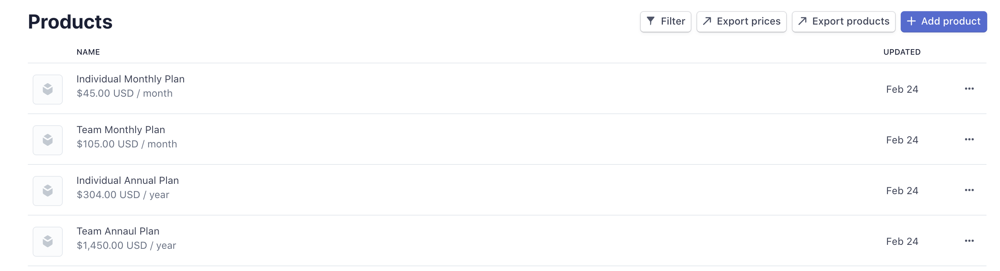
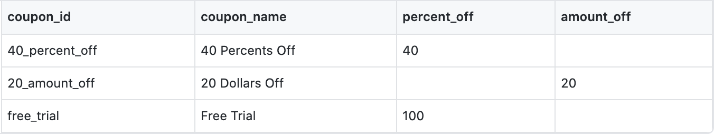
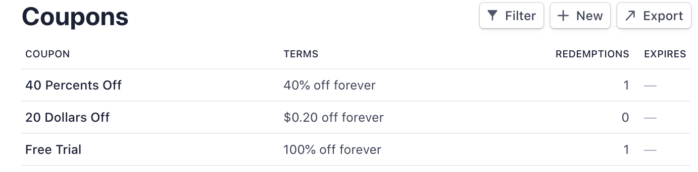
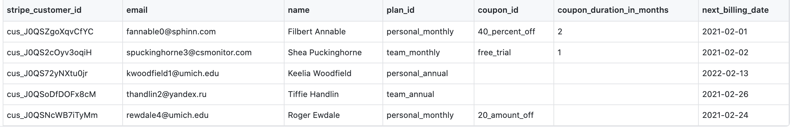
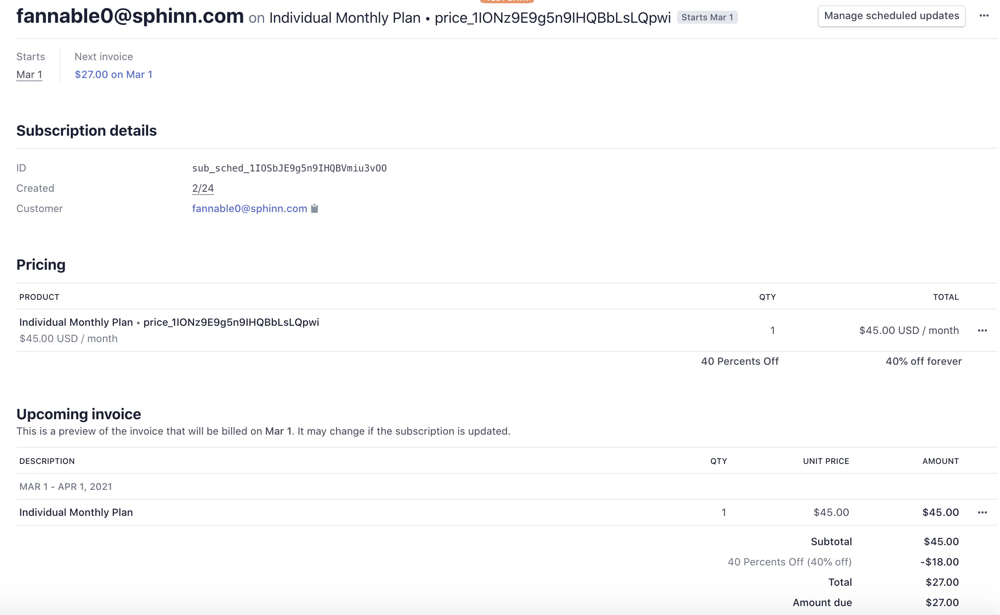
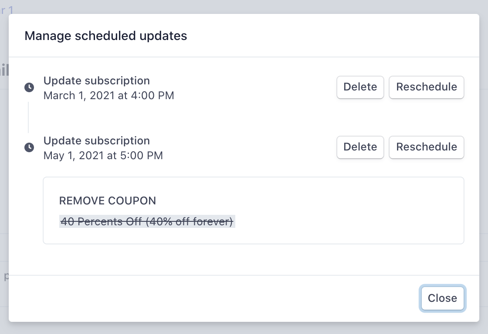

# Batch Processing Stripe Subscription

Stripe's migration process imports customers and their payment methods but doesn't import customers' subscriptions with the other payment processors. This POC explores the opportunity of automating Stripe subscriptions creation that supports the following needs:

- recreate subscriptions in Stripe to match customers' current subscriptions in the system
- allow delayed starts
- the ability to apply different discounts to subscriptions

### Step 1. Create Customers

Stripe imports customers and their payment methods as part of the migration process. Therefore, we don't need to create customers to automate subscriptions. However, we still need to run `createCustomers.js` as the first step to create mock customers on Stripe for demo purposes.

1. The script accepts a source CSV file with headers [`name`, `email`]
2. Run `node createCustomers.js <YOUR_MOCK_CUSTOMERS_FILE_NAME>` to create Stripe customers.
3. Each mock customer created by the script has a test card `pm_card_visa` attached as the payment method. Note that Stripe doesn't allow setting test cards as the default payment method programmatically. So we will need to set the test card as the default payment method manually on the Stripe dashboard.

**Sample source CSV file**

**Test Result**

### Step 2. Create Plans

For the next step, we run the `createPlans.js` script to recreate plans that match the system's existing ones. Each Stripe price object is created with a `lookup_key` that matches the original plan ID in the system.

1. The script accepts a source CSV file with the following headers

- `plan_id`: the product plan ID in the client's system
- `plan_name`: the customer-facing name of the product plan
- `price`: the unit price for each charge
- `interval`: accept value `month` or `year`

  2. Run `node createPlans.js <YOUR_MOCK_CUSTOMERS_FILE_NAME>` to create Stripe prices.

**Sample source CSV file**

**Test Result**

### Step 3. Create Coupons

We also need to create coupons to allow applying flexible discounts to subscription plans. We run the `createCoupons.js` script to create coupons on Stripe. Each Stripe coupon object has the same ID as its equivalent in the system.

1. The script accepts a source CSV file with the following headers

- `coupon_id`: the coupon ID in the client's system
- `coupon_name`: the customer-facing name of the coupon
- `percent_off`: the discount the coupon will apply
- `amount_off`: the amount to subtract from an invoice total

  2. Run `node createCoupons.js <YOUR_MOCK_COUPONS_FILE_NAME>` to create Stripe prices.

**Sample source CSV file**

**Test Result**

### Step 4. Create subscriptions

Finally, we will create subscriptions for customers using the `createSubscriptions.js` script. We use the [Stripe Subscription Schedules](https://stripe.com/docs/api/subscription_schedules) API to allow flexible billing start days (e.g., a day in the future will result in an invoice in the future, a day in the past will result in a prorated invoice) based on the client's current billing cycle.

This script also supports flexible discount rates. For example, a user may have a 3-month discount of 20% off a subscription. When this user moves to Stripe, the discount duration left is one month. In this scenario, the script will create a subscription schedule that charges the user with a 20% discount for the first month. The user will be billed the original price for the rest of the time.

1. The script accepts a source CSV file with the following headers

- `stripe_customer_id`: the user's Stripe ID
- `plan_id`: the user's subscription plan ID in the system
- `coupon_id`: the discount ID that applies to the user's current subscription
- `coupon_duration_in_months`: how long the discount will last in months
- `next_billing_date`: user's next billing date

  2. Run `node createSubscriptions.js <YOUR_MOCK_SUBSCRIPTION_FILE_NAME>` to recreate users' plans in the system.

**Test Result**

The script creates a subscription for Filbert that starts on March 1 with a discount of 40% off for 2 months.

This screenshot shows the 40% off coupon will be removed on May 1, 2021

